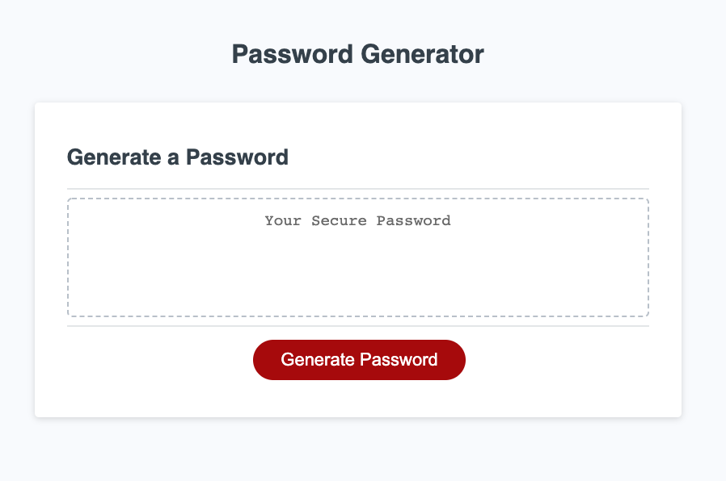
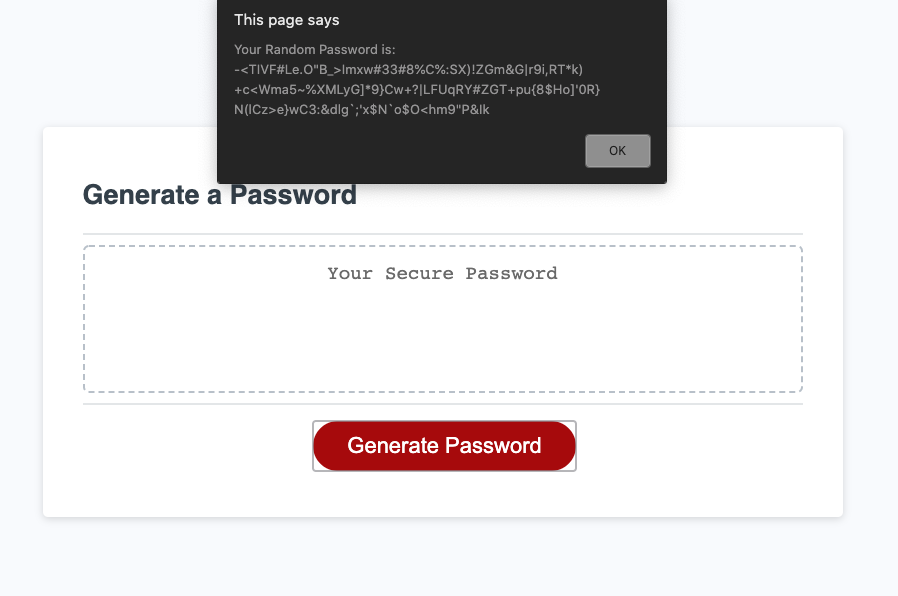

# **Sparsh Patwa's Personal Page**

## **Purpose**
Webpage that uses javascript to generate a random password based on te following user inputs:
* Password length
* Uppercase, lowercase, number and special characters.

## **Technologies Used**
* JS
* CSS
* HTML

## **URL**
https://sparshpatwa.github.io/ucb-03/

## **Screenshots**

## **Status**
Deployed using GITHUB
* TODO: User input JS function consolidation
